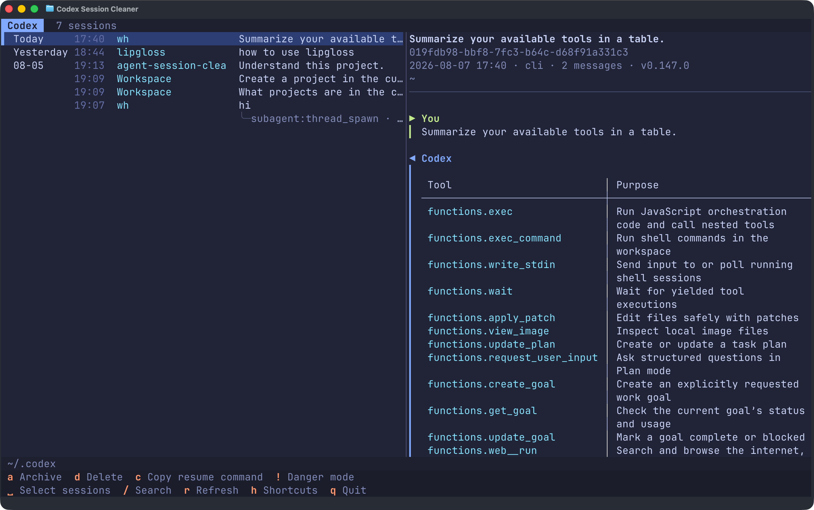

<div align="center">
  <h1>agent-session-cleaner</h1>
  <p><strong>Browse, resume, and clean up all your Codex, Claude Code, OpenCode, Pi, and Grok sessions from one terminal.</strong></p>
  <p>
    <a href="https://github.com/wangyuzz/agent-session-cleaner/releases/latest"></a>
    <a href="https://github.com/wangyuzz/agent-session-cleaner/actions/workflows/ci.yml"></a>
    
    <a href="./LICENSE"></a>
  </p>
  <p><strong>English</strong> · <a href="./README.zh-CN.md">简体中文</a></p>
</div>



This is a maintained fork of [haowang02/agent-session-cleaner](https://github.com/haowang02/agent-session-cleaner). It adds Windows command optimizations and native keyboard controls, Grok session support, resume-command copying, and Markdown exports. The original project and this fork are distributed under the MIT license.

## Install

Install or update on macOS and Linux:

```bash
curl -LsSf https://raw.githubusercontent.com/wangyuzz/agent-session-cleaner/main/install.sh | sh
```

Install or update from an open Windows PowerShell 5.1 or PowerShell 7 window:

```powershell
irm https://raw.githubusercontent.com/wangyuzz/agent-session-cleaner/main/install.ps1 | iex
```

This runs in the PowerShell version that is already open. When invoking it from Command Prompt or another launcher, use `powershell -NoProfile -ExecutionPolicy Bypass -Command "..."` for the built-in Windows PowerShell 5.1, or `pwsh -NoProfile -Command "..."` for PowerShell 7.

The Windows installer adds `%LOCALAPPDATA%\Programs\agent-session-cleaner\bin` to your user `PATH`. Open a new terminal after the first install.

## Usage

```bash
asc
# The full command name agent-session-cleaner is also available.
```

Run without arguments to choose an agent, or name one directly:

```bash
asc codex
asc claude
asc opencode
asc pi
asc grok
```

By default, the app uses `$CODEX_HOME` or `~/.codex` for Codex, `$CLAUDE_CONFIG_DIR` or `~/.claude` for Claude Code, `$XDG_DATA_HOME/opencode` or `~/.local/share/opencode` for OpenCode, `$PI_CODING_AGENT_DIR` or `~/.pi/agent` for Pi, and `$GROK_HOME` or `~/.grok` for Grok. On Windows, `~` is your user profile directory. To override a location explicitly:

```bash
asc --codex-home /path/to/codex
asc --claude-home /path/to/claude
asc --opencode-home /path/to/opencode
asc --pi-home /path/to/pi/agent
asc --grok-home /path/to/grok
```

The OpenCode path must name the `opencode` data directory itself, not its parent. The `opencode.db` file, when present, lives directly inside it.

Session discovery and previews read the stored data directly. Codex changes and OpenCode deletions require their respective CLIs; if a CLI is unavailable, that agent opens in browse-only mode. Claude Code, Pi, and Grok deletions operate directly on their session files.

### Codex command performance

Codex archive, unarchive, and delete operations start the Codex command once per session. On Windows, npm normally puts a `codex.cmd` and Node launcher in front of the native executable. When that standard npm layout is detected, the app automatically uses the bundled `codex.exe` instead. Unknown layouts safely fall back to `codex` on `PATH`.

To choose an executable or tune the number of simultaneous changes explicitly:

```bash
asc codex --codex-bin /path/to/codex --codex-concurrency 8
```

The equivalent environment variables are `ASC_CODEX_BIN` and `ASC_CODEX_CONCURRENCY`. Concurrency defaults to 4 on every platform; higher values can reduce batch time but may increase CPU, disk, or antivirus contention.

### Language

The interface follows the system language. Windows uses the user's preferred UI language; macOS and Linux use `LC_ALL`, `LC_MESSAGES`, `LANGUAGE`, or `LANG`. Chinese locales use Simplified Chinese; all other locales use English. To override detection:

```bash
ASC_LANG=en asc
ASC_LANG=zh-CN asc
```

In PowerShell, use `$env:ASC_LANG = "zh-CN"` before running `asc`.

## Keyboard shortcuts

The footer shows the shortcuts available for the current agent and installation. Windows builds show familiar Windows keys first while keeping the original letter and Vim-style keys as aliases. Press `F1` on Windows or `h` on any platform for the complete in-app reference.

| Key | Action | Supported by |
|---|---|---|
| `↑` `↓` / `j` `k` | Move to the previous / next session | All agents |
| `Home` / `End` (Windows), `g` / `G` | Jump to the top / bottom of the list | All agents |
| `Tab` | Switch between the session list and conversation | All agents |
| `␣` | Select or deselect the current session | All agents |
| `Ctrl+F` (Windows), `/` | Search titles, working directories, session IDs, and clients | All agents |
| `?` | Search backward | All agents |
| `F3` / `Shift+F3` (Windows), `n` / `N` | Jump to the next / previous match | All agents |
| `Alt+C` | Toggle case-sensitive search; search ignores case by default | All agents |
| `c` | Copy the resume command for the current session | All agents |
| `s` | Export the current session or selected sessions as Markdown | All agents |
| `w` (Windows), `y` | Copy the current session's working directory | All agents |
| `Delete` (Windows), `d` | Delete the current session or selected sessions | All agents |
| `a` | Archive the current session or selected sessions | Codex only |
| `u` | Unarchive the current session or selected sessions | Codex only |
| `x` (Windows), `D` | Delete all archived sessions | Codex only |
| `o` (Windows), `O` | Delete all orphaned sub-agent sessions | Codex and OpenCode |
| `e` (Windows), `E` | Delete all empty sessions | Claude Code and Grok |
| `F5` (Windows), `r` | Refresh the session list | All agents |
| `F1` (Windows), `h` | Show keyboard shortcuts | All agents |
| `!` | Toggle danger mode; individual deletions skip confirmation | All agents |
| `Esc` | Exit multi-select, turn off danger mode, or clear the search | All agents |
| `q` | Quit | All agents |

Press Space or double-click to select or deselect a session. Selecting a session includes all of its descendant sub-agent sessions. Actions supported by the current agent apply to every selected session; press `Esc` to clear the selection.

## Resume a session

To resume the current session, press `c` to copy the ready-to-run command (for example `grok --resume <session-id>`), then paste it into a terminal.

Press `Tab` to focus the conversation pane, then select text with the mouse to copy it. Press `s` to export the current session, or the selected sessions, as a Markdown file in the current directory.

## Export conversations

Press `s` to export the current session. When sessions are selected, the export combines them into one Markdown file. To save exports in an existing directory instead of the working directory:

```bash
asc codex --export-dir ~/session-exports
```

On Windows, for example:

```powershell
asc codex --export-dir "$env:USERPROFILE\Documents"
```

The `ASC_EXPORT_DIR` environment variable sets a default directory; `--export-dir` takes precedence. Create the directory before exporting. The status bar shows the saved file's full path or an error.

Exports preserve existing files by adding numbered suffixes (`-2`, `-3`, and so on), including when exports run concurrently. File names support Chinese text and avoid invalid Windows characters and reserved device names. Failed or cancelled exports remove their incomplete output. On macOS and Linux, new exports are readable and writable only by their owner; Windows uses the destination directory's inherited permissions.

Exports contain the same human and assistant messages as the session preview, rather than a full transcript backup. Each message is limited to 8,000 characters, with an explicit note when text is truncated. Image attachments are represented by counts, and tool traffic is omitted.

## Deletion and archiving

> [!WARNING]
> This tool does not create backups. Deleted sessions cannot be recovered.

- Deleting or archiving a session also includes its descendant sub-agent sessions.
- Codex archive, unarchive, and delete operations are delegated to the Codex CLI.
- Claude Code deletion removes the transcript and its related session data directly.
- OpenCode deletion is delegated to the OpenCode CLI.
- Pi deletion removes the session file directly.
- Grok deletion removes the session directory directly.
- In danger mode (`!`), individual deletions skip confirmation. Bulk deletion still asks for confirmation.

## Acknowledgements

- [haowang02/agent-session-cleaner](https://github.com/haowang02/agent-session-cleaner) — the original project
- [LINUX DO](https://linux.do/) — a community for builders and curious minds

See [CONTRIBUTING.md](./CONTRIBUTING.md) for local builds and validation.
