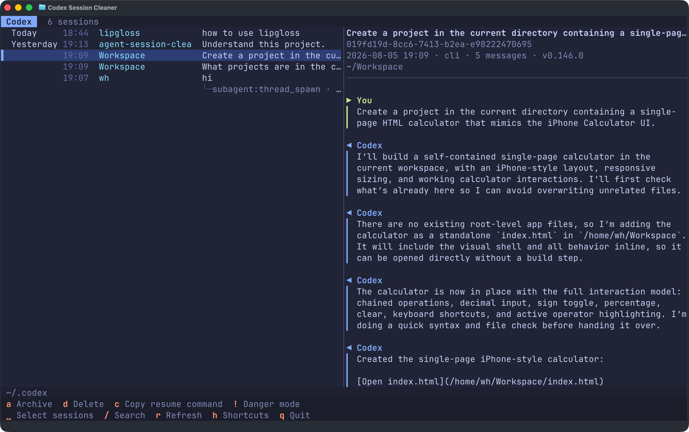

<div align="center">
  <h1>agent-session-cleaner</h1>
  <p><strong>Browse, resume, and clean up all your Codex, Claude Code, and OpenCode sessions from one terminal.</strong></p>
  <p>
    <a href="https://github.com/haowang02/agent-session-cleaner/releases/latest"></a>
    <a href="https://github.com/haowang02/agent-session-cleaner/actions/workflows/ci.yml"></a>
    
    <a href="./LICENSE"></a>
  </p>
  <p><strong>English</strong> · <a href="./README.zh-CN.md">简体中文</a></p>
</div>



## Install

Each release includes a `.tar.gz` archive containing one self-contained executable. Extract it into the current directory and run it; no runtime dependencies are required.

macOS · Apple silicon:

```bash
curl -fsSL https://github.com/haowang02/agent-session-cleaner/releases/latest/download/agent-session-cleaner-macos-arm64.tar.gz \
  | tar -xzf -
```

macOS · Intel:

```bash
curl -fsSL https://github.com/haowang02/agent-session-cleaner/releases/latest/download/agent-session-cleaner-macos-x86_64.tar.gz \
  | tar -xzf -
```

Linux · x86_64:

```bash
curl -fsSL https://github.com/haowang02/agent-session-cleaner/releases/latest/download/agent-session-cleaner-linux-x86_64.tar.gz \
  | tar -xzf -
```

Linux · arm64:

```bash
curl -fsSL https://github.com/haowang02/agent-session-cleaner/releases/latest/download/agent-session-cleaner-linux-arm64.tar.gz \
  | tar -xzf -
```

> [!WARNING]
> If macOS blocks a binary downloaded through your browser, run `xattr -d com.apple.quarantine agent-session-cleaner`, then try again.

You can also install from source. Install [Go](https://go.dev/dl/) 1.25 or newer first:

```bash
go install github.com/haowang02/agent-session-cleaner/cmd/agent-session-cleaner@latest
```

## Usage

```bash
agent-session-cleaner
```

Run without arguments to choose an agent, or name one directly:

```bash
agent-session-cleaner codex
agent-session-cleaner claude
agent-session-cleaner opencode
```

By default, the app uses `$CODEX_HOME` or `~/.codex` for Codex, `$CLAUDE_CONFIG_DIR` or `~/.claude` for Claude Code, and `$XDG_DATA_HOME/opencode` or `~/.local/share/opencode` for OpenCode. To override a location explicitly:

```bash
agent-session-cleaner --codex-home /path/to/codex
agent-session-cleaner --claude-home /path/to/claude
agent-session-cleaner --opencode-home /path/to/opencode
```

The OpenCode path must name the `opencode` data directory itself, not its parent. The `opencode.db` file, when present, lives directly inside it.

Session discovery and previews read the stored data directly. Codex changes and OpenCode deletions require their respective CLIs; if a CLI is unavailable, that agent opens in browse-only mode. Claude Code deletions operate directly on its session files.

### Language

The interface follows your locale (`LC_ALL`, `LC_MESSAGES`, `LANGUAGE`, or `LANG`). Chinese locales use Simplified Chinese; all other locales use English. To override detection:

```bash
AGENT_SESSION_CLEANER_LANG=en agent-session-cleaner
AGENT_SESSION_CLEANER_LANG=zh-CN agent-session-cleaner
```

## Keyboard shortcuts

The footer shows the shortcuts available for the current agent and installation. Press `h` for the complete in-app reference.

| Key | Action | Supported by |
|---|---|---|
| `↑` `↓` / `j` `k` | Move to the previous / next session | All agents |
| `g` / `G` | Jump to the top / bottom of the list | All agents |
| `Tab` | Switch between the session list and conversation | All agents |
| `␣` | Select or deselect the current session | All agents |
| `/` | Search titles, working directories, session IDs, and clients | All agents |
| `?` | Search backward | All agents |
| `n` / `N` | Jump to the next / previous match | All agents |
| `c` | Copy the resume command for the current session | All agents |
| `d` | Delete the current session or selected sessions | All agents |
| `a` | Archive the current session or selected sessions | Codex only |
| `u` | Unarchive the current session or selected sessions | Codex only |
| `D` | Delete all archived sessions | Codex only |
| `O` | Delete all orphaned sub-agent sessions | Codex and OpenCode |
| `E` | Delete all empty sessions | Claude Code only |
| `r` | Refresh the session list | All agents |
| `h` | Show keyboard shortcuts | All agents |
| `!` | Toggle danger mode; individual deletions skip confirmation | All agents |
| `Esc` | Exit multi-select, turn off danger mode, or clear the search | All agents |
| `q` | Quit | All agents |

Press Space or double-click to select or deselect a session. Selecting a session includes all of its descendant sub-agent sessions. Actions supported by the current agent apply to every selected session; press `Esc` to clear the selection.

## Resume a session

Press `c` to copy a ready-to-run command for the current session. If the session records a working directory, the command enters that directory first so the agent resumes in the correct project context. With the default data directories, commands look like this:

```bash
cd /path/to/project && codex resume <session-id>
cd /path/to/project && claude --resume <session-id>
cd /path/to/project && opencode -s <session-id>
```

When a custom data directory is in use, the copied command also includes the corresponding `CODEX_HOME`, `CLAUDE_CONFIG_DIR`, or `XDG_DATA_HOME` assignment.

## Deletion and archiving

> [!WARNING]
> This tool does not create backups. Deleted sessions cannot be recovered.

- Deleting or archiving a session also includes its descendant sub-agent sessions.
- Codex archive, unarchive, and delete operations are delegated to the Codex CLI.
- Claude Code deletion removes the transcript and its related session data directly.
- OpenCode deletion is delegated to the OpenCode CLI.
- In danger mode (`!`), individual deletions skip confirmation. Bulk deletion still asks for confirmation.

## Acknowledgements

- [LINUX DO](https://linux.do/) — a community for builders and curious minds
