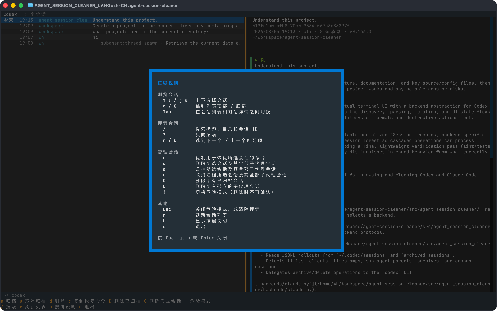

# agent-session-cleaner

[English](./README.md)

在终端里浏览和清理 Codex、Claude Code 历史会话。



## 安装

macOS · Apple 芯片：

```bash
curl -L -o agent-session-cleaner \
  https://github.com/haowang02/agent-session-cleaner/releases/latest/download/agent-session-cleaner-macos-arm64
chmod +x agent-session-cleaner
```

macOS · Intel：

```bash
curl -L -o agent-session-cleaner \
  https://github.com/haowang02/agent-session-cleaner/releases/latest/download/agent-session-cleaner-macos-x86_64
chmod +x agent-session-cleaner
```

Linux · x86_64：

```bash
curl -L -o agent-session-cleaner \
  https://github.com/haowang02/agent-session-cleaner/releases/latest/download/agent-session-cleaner-linux-x86_64
chmod +x agent-session-cleaner
```

Linux · arm64：

```bash
curl -L -o agent-session-cleaner \
  https://github.com/haowang02/agent-session-cleaner/releases/latest/download/agent-session-cleaner-linux-arm64
chmod +x agent-session-cleaner
```

> [!WARNING]
> 如果 macOS 拦截了浏览器下载的文件，先执行
> `xattr -d com.apple.quarantine agent-session-cleaner`，再重新运行。

也可以从源码安装。请先安装 [uv](https://github.com/astral-sh/uv)：

```bash
git clone https://github.com/haowang02/agent-session-cleaner
cd agent-session-cleaner
uv tool install .
```

## 使用

```bash
agent-session-cleaner
```

启动后选择 Codex 或 Claude Code；也可以在命令中直接指定：

```bash
agent-session-cleaner codex
agent-session-cleaner claude
```

默认读取 `~/.codex` 和 `~/.claude`。如需使用其他目录：

```bash
agent-session-cleaner --codex-home /path/to/codex
agent-session-cleaner --claude-home /path/to/claude
```

### 语言

界面会跟随系统 locale（`LC_ALL`、`LC_MESSAGES`、`LANGUAGE` 或 `LANG`）：中文
locale 显示简体中文，其他语言显示英文。如需覆盖自动检测：

```bash
AGENT_SESSION_CLEANER_LANG=en agent-session-cleaner
AGENT_SESSION_CLEANER_LANG=zh-CN agent-session-cleaner
```

## 快捷键

界面底部会列出当前可用的快捷键。按 `h` 可查看完整说明。

| 键 | 作用 |
|---|---|
| `↑` `↓` / `j` `k` | 上下选择会话 |
| `g` / `G` | 跳到列表顶部 / 底部 |
| `Tab` | 在会话列表和对话详情之间切换 |
| `/` | 搜索标题、目录和会话 ID |
| `?` | 反向搜索 |
| `n` / `N` | 下一个 / 上一个匹配项 |
| `c` | 复制所选会话的恢复命令 |
| `d` | 删除选中的会话 |
| `r` | 刷新会话列表 |
| `h` | 按键说明 |
| `!` | 切换危险模式 |
| `Esc` | 关闭危险模式，或清除搜索 |
| `q` | 退出 |

Codex 还支持：

| 键 | 作用 |
|---|---|
| `a` | 归档选中的会话 |
| `u` | 取消归档选中的会话 |
| `D` | 删除所有已归档会话 |
| `O` | 删除所有孤立的子代理会话 |

Claude Code 还支持：

| 键 | 作用 |
|---|---|
| `E` | 删除所有空会话 |

对于 Codex，归档或删除一条会话时，它派生的子代理会话也会一并处理。

## 恢复会话

按 `c` 可复制一条直接恢复所选会话的命令。如果会话记录了工作目录，命令会先进入该
目录，确保 Agent 在正确的项目上下文中恢复：

```bash
cd /path/to/project && codex resume <session-id>
cd /path/to/project && claude --resume <session-id>
```

## 删除与归档原理

> [!WARNING]
> 本工具不会备份数据，删除后无法恢复！

- Codex 的归档和删除由 Codex 命令行工具执行；没有安装 Codex CLI 时，可以浏览，
  但不能修改 Codex 会话。
- Claude Code 会删除会话记录及其同名附属目录，但不会清理其他缓存。
- ⚠️ 危险模式（`!`）下，按 `d` 会跳过确认并直接删除。

## 致谢

- [LINUX DO](https://linux.do/)——新的理想型社区
